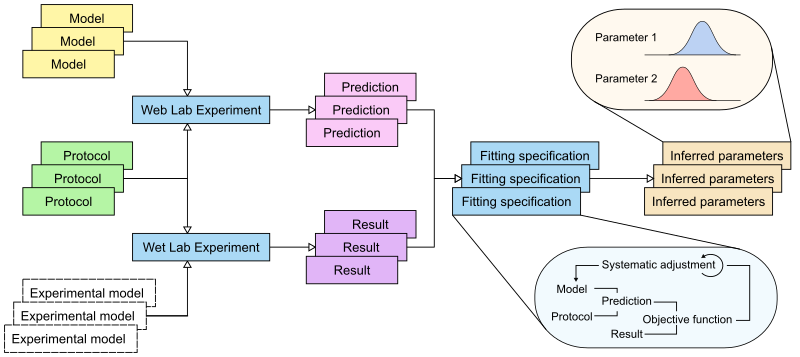

# The Cardiac Electrophysiology Web Lab

- [Click here for links to code, prototypes, and more information](links.md).
- [Click here for the WL1/WL2/Web Lab terminology disambiguation](terminology.md).

_The following document describes the **intended** features of the new web lab (2018-05-21)._

The Cardiac Electrophysiology Web Lab (WL2) links models of cellular electrophysiology with protocols describing experimental procedures, and with experimental data obtained from the same procedures.
Users can simulate and view the outcome of applying any protocol to any (compatible) model, and can compare the results to stored experimental data files.
Using the same interface, users can compare data files to each other, or inspect the predictions of different models for the same experiment.
Moving beyond qualitative comparison, numerical error measures can be defined and then minimised by algorithmically tuning model parameters.

The figure above shows the general outline of WL2.
The individual components and their connections are described below.

## Models

A model is a system of ordinary differential equations (ODEs) that describes (some aspects of) the electrophysiology (EP) of a cell, plus a physiologically viable set of initial states.
Most models describe either a single ionic current, or a set of currents plus the ionic diffusion mechanisms that give rise to the cellular action potential (AP).
Some models also include other aspects such as signalling or contraction mechanics.

Models are written in [CellML 1.0 or 1.1](http://cellml.org/).

In the current implementation, models are stored on the website, but we'd like to move to a situation where they're kept in external repositories, e.g. the Physiome Model Repository (PMR, also known as the [CellML Model Repository](https://models.physiomeproject.org/cellml)).

### Annotation

Models are linked to protocols via an ontology that lists common model variables, e.g. the major currents (INa, ICaL, IKr, etc.) and their maximum conductances.
Currently, annotation happens by modifying the CellML files.

**Point of action**: decide whether to keep annotations inside the CellML files or use an external mechanism.
External annotation is harder to work with, but more flexible as it allows us to annotate models not stored on our own servers.

We currently use the [`oxmeta` ontology](https://github.com/Chaste/Chaste/blob/release/python/pycml/oxford-metadata.ttl), which is distributed as part of Chaste .

**Point of action**: We need to either find a community ontology, or work towards standardising our one (e.g. move from chaste to its own repo, get some input from others, given them access etc.).

- Note 1: There is also an [rdf file](https://github.com/Chaste/Chaste/blob/release/python/pycml/oxford-metadata.rdf).
- Note 2: The XML namespace for the annotations is https://chaste.comlab.ox.ac.uk/cellml/ns/oxford-metadata (not a link!).

### Stimulus current

Typically, the CellML version of a model includes a stimulus current.
This is essential a default protocol, and so it can be argued this should not be part of a model.

- Note 1: The same holds for physical constants and physiological parameters such as temperature or membrane area: in a modular set-up these should really not be part of the _cell_ model.
- Note 2: In addition, most stimulus protocols are discontinuous, and consist of a small jump of 0.5, 1, or 2ms in a 1000ms period.
Unless the solver somehow knows when these jumps are, simulations need to be run with a maximum step size of e.g. 1ms.
This is inefficient during the systolic/refractory phase, where steps of over 100ms could otherwise be made.

## Protocols

At the moment, protocols are written using the [Functional Curation syntax](https://chaste.cs.ox.ac.uk/trac/wiki/FunctionalCuration).

**Point of action:** We need to decide whether to stick with this or come up with an easier-to-use alternative.

This might involve:

- Replacing FC with something procedural e.g. sandboxed Python (but then do we lose platform/tool independence?)
- Coming up with tools that simplify working with FC (e.g. a Python/Myokit library that users can use procedurally, but that then generates FC code?

### SED-ML

SED-ML is a community standard to describe experiments, but its capabilities are much more limited than functional curation

## Experimental data

WL2 needs the capability to display and process experimental data.

### Pre and post-processing

WL2 does _not_ include initial preprocessing such as capacitance artefact removal, leak correction, subtraction protocols etc.
It _does_ include secondary preprocessing such as calculating IV curves from (clean up) current recordings.
To allow initial preprocessing to be inspected and/or re-done, we would ideally store (1) cleaned up, annotated data in an approved exchange format, and (2) free-form raw data along with pre-processing code (e.g. proprietary data formats and matlab scripts).

Further pre and post-processing currently happens via functional curation (see [Protocols](#protocols)).

## Simulations

