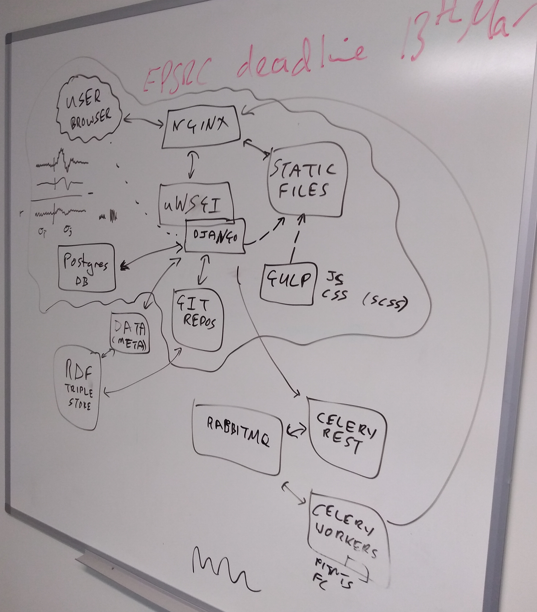

# Web Lab infrastructure

This document describes (or links to existing documentation of?) the infrastructure on which Web Labs (such as the Cardiac Electrophysiology one) run.

[Look here for issue tracking / project management](https://github.com/ModellingWebLab/project_issues/issues)

The best description of the full infrastructure is currently given as an [Ansible configuration](https://github.com/ModellingWebLab/deployment). There is an "ansible playbook" that can install the Web Lab for servers or locally, and load updates etc.

The plans for the final set-up are given in [this presentation Jonathan prepared for Harmony 2018](https://github.com/ModellingWebLab/WLDocs/blob/master/doc/WL2%20technical%20detail.pdf)

There's also this: 

## Deployment with Vagrant and Ansible

[Vagrant](https://www.vagrantup.com/docs/index.html) ([wiki](https://en.wikipedia.org/wiki/Vagrant_%28software%29)) is a tool for "building and maintaining virtual software development environments".
For the WebLab, we use Vagrant to create and manage [VirtualBox](https://en.wikipedia.org/wiki/VirtualBox) machines, which are automatically set up for development or production using Ansible.
Users can connect to running vagrant machines using ``$ vagrant ssh``.

[Ansible](https://docs.ansible.com/) ([wiki](https://en.wikipedia.org/wiki/Ansible_(software))) is a tool to set up development environments, or deploy applications to some production environment.

The WebLab [deployment](https://github.com/ModellingWebLab/deployment) repo contains several [Ansible playbooks](https://docs.ansible.com/ansible/latest/user_guide/playbooks_intro.html), which each set up some part of the WebLab infrastructure.
Overlapping parts of playbooks are shared via [roles](https://docs.ansible.com/ansible/latest/user_guide/playbooks_reuse_roles.html)).

See also: [Using Vagrant and Ansible](https://docs.ansible.com/ansible/latest/scenario_guides/guide_vagrant.html)

