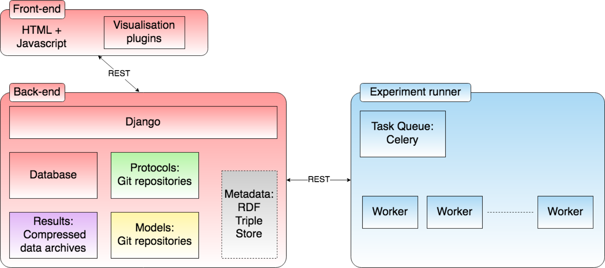

# Web Lab infrastructure

This document describes (or links to existing documentation of?) the infrastructure on which Web Labs (such as the Cardiac Electrophysiology one) run.

[Look here for issue tracking / project management](https://github.com/ModellingWebLab/project_issues/issues)

The best description of the full infrastructure is currently given as an [Ansible configuration](https://github.com/ModellingWebLab/deployment). There is an "ansible playbook" that can install the Web Lab for servers or locally, and load updates etc.

The plans for the final set-up are given in [this presentation Jonathan prepared for Harmony 2018](https://github.com/ModellingWebLab/WLDocs/blob/master/doc/WL2%20technical%20detail.pdf)

## Getting started

To get started practically, jump down to the deployment section **TODO: ADD LINK**

## Overview

This diagram describes the general purpose Web Lab infrastructure.

## Django website

The website is written in Python using [Django](https://docs.djangoproject.com/en/2.2/).
The Django server serves up a HTML and javascript front-end, which can interact with the Django server backend via a REST API.
**JONATHAN: DID WE ADD ANYTHING HERE, OR IS THIS ALL HANDLED BY DJANGO?**

The django back-end can access data from various sources (databases, local files, git repositories, a metadata triple store), and can communicate with the "task queue" to execute experiments via a REST API.
**JONATHAN: IS THIS API DOCUMENTED SOMEWHERE?**

### Database

PostgreSQL?

### Git repositories

Where are they located? What python module do we use to access them?

### Local file storages

### Triple store

## Running experiments

Experiments are run by placing them into a [Celery](http://docs.celeryproject.org/en/latest/index.html) task queue ([wiki](https://en.wikipedia.org/wiki/Celery_(software)).
One or multiple workers then take tasks from the queue and execute them.
This way, the actual running of experiments can be offloaded to a cloud of worker machines.

The workers talk to the queue via a message passing system.
Instead of talking to each other directly, messaging is handled via a *broker*, for which Web Lab uses [RabbitMQ](https://www.rabbitmq.com/documentation.html) ([wiki](https://en.wikipedia.org/wiki/RabbitMQ)).
See also [Celery docs: Using RabbitMQ](http://docs.celeryproject.org/en/latest/getting-started/brokers/rabbitmq.html).

### Cardiac web lab tasks

The tasks that the Cardiac Electrophysiology Web Lab runs are defined in the [fc-runner] repository.

More information is given [here](./infrastructure-cardiac.md).

## Deployment with Vagrant and Ansible

[Vagrant](https://www.vagrantup.com/docs/index.html) ([wiki](https://en.wikipedia.org/wiki/Vagrant_%28software%29)) is a tool for "building and maintaining virtual software development environments".
For the WebLab, we use Vagrant to create and manage [VirtualBox](https://en.wikipedia.org/wiki/VirtualBox) machines, which are automatically set up for development or production using Ansible.
Users can connect to running vagrant machines using ``$ vagrant ssh``.

[Ansible](https://docs.ansible.com/) ([wiki](https://en.wikipedia.org/wiki/Ansible_(software))) is a tool to set up development environments, or deploy applications to some production environment.

The WebLab [deployment](https://github.com/ModellingWebLab/deployment) repo contains several [Ansible playbooks](https://docs.ansible.com/ansible/latest/user_guide/playbooks_intro.html), which each set up some part of the WebLab infrastructure.
Overlapping parts of playbooks are shared via [roles](https://docs.ansible.com/ansible/latest/user_guide/playbooks_reuse_roles.html)).

See also: [Using Vagrant and Ansible](https://docs.ansible.com/ansible/latest/scenario_guides/guide_vagrant.html)

Five playbooks are defined:

### Site

Stored in `site.yml`, this is the main playbook, and does nothing other than simply importing the remaining four playbooks.

### Web servers

Stored in `webservers.yml`, this sets up a Django server.
**JONATHAN: Can there be more than one of these as the name suggests? How would they interact? Esp. given local files?**

### Task Queue

**NOT 100% sure. Does this define a queue on disk somewhere, or does it start a daemon?**

### Workers

Sets up celery workers **How many? And all on the same machine?**

### Broker

# Whiteboard

There's also this: 

