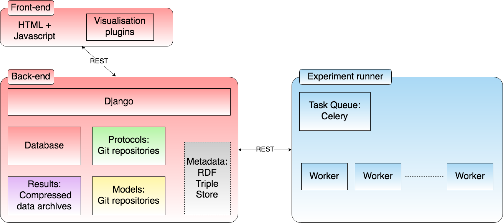

[🏠 Go back to the home page](./README.md)

# Web Lab infrastructure

This document describes (or links to existing documentation of) the infrastructure on which Web Labs (such as the Cardiac Electrophysiology Web Lab) run.

Briefly, the [Web Lab](https://github.com/ModellingWebLab/WebLab) front-end is a Django website which communicates with a ["Functional Curation"](https://github.com/ModellingWebLab/weblab-fc) back-end via a task queue implemented in ["fc-runner" (aka fcws)](https://github.com/ModellingWebLab/fc-runner).

The best description of the full infrastructure is currently given as an [Ansible configuration](https://github.com/ModellingWebLab/deployment). There is an "ansible playbook" that can install the Web Lab for servers or locally, and load updates etc.

The plans for the final set-up are given in [this presentation Jonathan prepared for Harmony 2018](https://github.com/ModellingWebLab/WLDocs/blob/master/doc/WL2%20technical%20detail.pdf)

There's also this: 

[Project-wide issues (not tied to any specific component) go here](https://github.com/ModellingWebLab/project_issues/issues)

## Getting started

To get started practically, jump down to the [deployment section](#deployment-with-vagrant-and-ansible).

## Overview

This diagram describes the general purpose Web Lab infrastructure.

## WebLab :: Django website (Front-end)

The website is written in Python using [Django](https://docs.djangoproject.com/en/1.11/).
The current Django application is slightly cardiac-specific, and is hosted in the [WebLab](https://github.com/ModellingWebLab/WebLab) repository.

The django application can access data from various sources (databases, local files, git repositories, a metadata triple store (not implemented yet)), and can communicate with the "task queue" to execute experiments via a [REST API](https://github.com/ModellingWebLab/WebLab/blob/master/docs/experiment_runner_rest_api.md).

To make the Django application respond to HTTP requests, we use the `nginx` web server.
Requests for static files are handled by `nginx` directly, other requests are passed to the Django server via `uwsgi`, which is a "WSGI" server (a bit like a CGI server).

The Django server serves up a HTML and javascript front-end, which can interact with the Django server backend via a REST API.

### nginx and uwsgi

nginx is a web server (think equivalent of Apache but more lightweight). 
uwsgi is a WSGI server, which serves WSGI apps (Django in our case) - think faster CGI.
Requests come in to nginx which responds directly if a static resource, or hands off to Django via uwsgi if not.

The back-end fc-runner is also served via nginx, but this time it's an old-fashioned CGI app wrapped via fcgiwrap, since nginx doesn't do old-fashioned CGI natively.

### Database

PostgreSQL.
Gets created by the Ansible deployment (including setting up a DB user for access) and the schema is defined by Django.

### Git repositories

Stored in Django's data dir, path defined in `config/settings` in `REPO_BASE`.

Accessed with [gitpython](https://gitpython.readthedocs.io/en/stable/reference.html) via `entities/repository.py`.

### Local file storages

Used for datasets and predictions. Again the location is defined in Django settings (`DATASETS_BASE` and `EXPERIMENT_BASE` respectively).

### Triple store

Not yet implemented; will contain a copy of metadata associated with models, datasets, etc. to support searching; also the 'metadata interface' of protocols to support determining compatibility.

## Task-runner (communication from front to back-end)

Happens via a task queue, communicated with via a REST API.

### FC-Runner

The [fc-runner](https://github.com/ModellingWebLab/fc-runner) repository contains a CGI script that can be called by the Django front-end.

It handles these tasks:

- Determining a protocol interface (i.e. the variable annotations it requires)
- Scheduling experiments
- Cancelling scheduled experiments
- Checking the protocol's syntax for correctness (results will be displayed by the front-end)

### Scheduling experiments

Experiments are schedule by placing them into a [Celery](http://docs.celeryproject.org/en/latest/index.html) task queue ([wiki](https://en.wikipedia.org/wiki/Celery_(software)).
One or multiple workers then take tasks from the queue and execute them.
This way, the actual running of experiments can be offloaded to a cloud of worker machines.

The workers talk to the queue via a message passing system.
Instead of talking to each other directly, messaging is handled via a *broker*, for which Web Lab uses [RabbitMQ](https://www.rabbitmq.com/documentation.html) ([wiki](https://en.wikipedia.org/wiki/RabbitMQ)).
See also [Celery docs: Using RabbitMQ](http://docs.celeryproject.org/en/latest/getting-started/brokers/rabbitmq.html).

Further information is given [here](./infrastructure-cardiac.md).

## Functional Curation (back-end)

Todo.

## Deployment (using Vagrant and Ansible)

[Vagrant](https://www.vagrantup.com/docs/index.html) ([wiki](https://en.wikipedia.org/wiki/Vagrant_%28software%29)) is a tool for "building and maintaining virtual software development environments".
For the WebLab, we use Vagrant to create and manage [VirtualBox](https://en.wikipedia.org/wiki/VirtualBox) machines, which are automatically set up for development or production using Ansible.
Users can connect to running vagrant machines using ``$ vagrant ssh``.

[Ansible](https://docs.ansible.com/) ([wiki](https://en.wikipedia.org/wiki/Ansible_(software))) is a tool to set up production (or development) environments.

The WebLab [deployment](https://github.com/ModellingWebLab/deployment) repo contains several [Ansible playbooks](https://docs.ansible.com/ansible/latest/user_guide/playbooks_intro.html), which each set up some part of the WebLab infrastructure.
Overlapping parts of playbooks are shared via [roles](https://docs.ansible.com/ansible/latest/user_guide/playbooks_reuse_roles.html)).

See also: [Using Vagrant and Ansible](https://docs.ansible.com/ansible/latest/scenario_guides/guide_vagrant.html)

Five playbooks are defined:

### Site

Stored in `site.yml`, this is the main playbook, and does nothing other than simply importing the remaining four playbooks.

### Web servers

Stored in `webservers.yml`, this sets up a Django server.
At the moment, there's only a single server, but we may want to consider more in the future e.g. for load balancing.

### Task Queue

Sets up the non-worker parts of celery (basically just checking out the repo), and the fc-runner REST web service (configuring nginx etc).

### Workers

Sets up celery workers, using configuration from `group_vars` and defaults for the roles.

### Broker

Sets up rabbitmq
